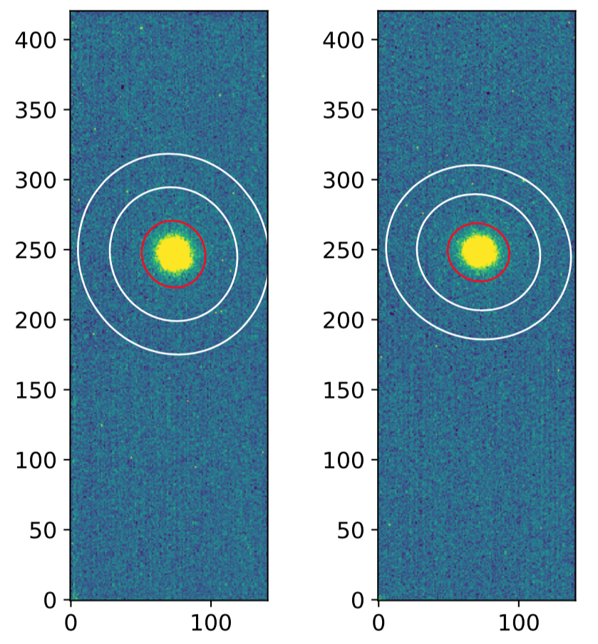

# NICpolpy
Nishi Harima Astronomical Observatory (NHAO)'s Near-Infrared Camera (NIC) Polarimetry photometry pipeline.

Under-development by Yoonsoo P. Bach at Seoul National University, South Korea, since late 2019.


## 1. Installation
You will need
1. Python **3.6+** (recommended: [Anaconda 3](https://www.anaconda.com/distribution/#download-section))
2. Dependencies (I will assume you used Anaconda 3; otherwise, use pip3):

### 1-1. First time
<details><summary>For the <b>first</b> installation (click):</summary>
<p><pre>
# On terminal
conda install -c astropy astroquery photutils ccdproc astroscrappy
conda install -c openastronomy sep
cd ~            # whatever directory you want
mkdir github    # whatever name you want
git clone https://github.com/ysBach/ysfitsutilpy.git
cd ysfitsutilpy && python setup.py install && cd ..
git clone https://github.com/ysBach/ysphotutilpy.git
cd ysphotutilpy && python setup.py install && cd ..
git clone https://github.com/ysBach/NICpolpy.git
cd NICpolpy && python setup.py install && cd ..
</p>
</pre>
</details>

### 1-2. After the first
If you need to update any of these, just do
```
cd ~/github/ysfitsutilpy && git pull && python setup.py install
cd ~/github/ysphotutilpy && git pull && python setup.py install
cd ~/github/NICpolpy && git pull && python setup.py install
```


## 2. Basic Usage
All the preprocessing intermediate results are stored, with appropriate header information.

The processing with ``NICpolpy``:

* **Memory < 100 MB** for processing
* **Speed = 100 ± 10 frames/second**
* CPU load = **20-30 %**
* Example code for image preprocessing & photometry : [here](example/preproc_and_phot.py).

(Tested on MBP 2018 15" 2.6 GHz i7)


Also *please refer to the verbose output as well as FITS header* such as the one at the **end of this README**.

The photometry was done by automatic aperture/annulus selection (example of h191108_0400):



*left: o-ray, right: e-ray. The red is the elliptical aperture and the white is the elliptical annulus for sky. The FWHM is estimated from Source-Extractor-like extraction, and aperture radius = 2FWHM, annulus radii = (4FWHM, 6FWHM) for both x(major) and y(minor) axes of the source's shape.*

## Note
Some data from NHAO NIC is in 32-bit format, using twice the storage than required. You may use [this example code](example/convert_16bit.py) to **convert those into 16-bit** without losing any dynamic range.

## Sample header

Note the long description in the ``HISTORY``. Virtually no need to write any other laboratory notes or the descriptions for what the codes do.

``h191108_0040.fits``, Vesta, ``EXPTIME = 3.0``, o-ray:
```
SIMPLE  =                    T / conforms to FITS standard
BITPIX  =                  -32 / array data type
NAXIS   =                    2 / number of array dimensions
NAXIS1  =                  141
NAXIS2  =                  421
COMMENT   FITS (Flexible Image Transport System) format is defined in 'Astronomy
COMMENT   and Astrophysics', volume 376, page 359; bibcode: 2001A&A...376..359H
COMMENT ['PROCESS key can be B (bias), D (dark), F (flat), T (trim), W (WCS astr
COMMENT ometry), C(CRrej).']
COMMENT .................................................2020-01-08T08:20:59.774
HISTORY  Copy of image h191108_0400.fits rotated 180 degrees
HISTORY From the user, gain = 9.8 [unit = electron / adu]
HISTORY ..................................(dt = 0.001 s) 2020-01-08T08:20:59.723
HISTORY From the user, rdnoise = 75.0 [unit = electron]
HISTORY ..................................(dt = 0.001 s) 2020-01-08T08:20:59.725
HISTORY Dark scaling True using EXPTIME
HISTORY .................................................2020-01-08T08:20:59.802
HISTORY Dark subtracted (see DARKPATH)
HISTORY ..................................(dt = 0.019 s) 2020-01-08T08:20:59.825
HISTORY Vertical pattern subtracted using ['[:, 50:150]', '[:, 874:974]'] by tak
HISTORY ing median with sigma-clipping in astropy (v 3.2.3), given {'sigma': 2,
HISTORY 'maxiters': 5}.
HISTORY ..................................(dt = 0.037 s) 2020-01-08T08:20:59.872
HISTORY Flat corrected (see FLATPATH)
HISTORY ..................................(dt = 0.003 s) 2020-01-08T08:20:59.937
HISTORY Pixel error calculated for both o/e-rays
HISTORY ..................................(dt = 0.055 s) 2020-01-08T08:21:00.026
HISTORY Cosmic-Ray rejected by astroscrappy (v 1.0.8), with parameters: {'gain':
HISTORY  9.8, 'readnoise': 75, 'sigclip': 4.5, 'sigfrac': 5, 'objlim': 5, 'satle
HISTORY vel': 65535.0, 'pssl': 0.0, 'niter': 4, 'sepmed': True, 'cleantype': 'me
HISTORY dmask', 'fsmode': 'median', 'psfmodel': 'gauss', 'psffwhm': 2.5, 'psfsiz
HISTORY e': 7, 'psfk': None, 'psfbeta': 4.765}
HISTORY ..................................(dt = 0.036 s) 2020-01-08T08:21:00.063
HISTORY Background estimated from sep (v 1.10.0) with {'maskthresh': 0.0, 'filte
HISTORY r_threshold': 0.0, 'box_size': (64, 64), 'filter_size': (12, 12)}.
HISTORY ..................................(dt = 0.002 s) 2020-01-08T08:21:00.105
HISTORY Objects found from sep (v 1.10.0) with {'thresh': 1, 'minarea': 100, 'be
HISTORY zel_x': (40, 40), 'bezel_y': (150, 100)}.
HISTORY ..................................(dt = 0.014 s) 2020-01-08T08:21:00.119
HISTORY Photometry done for elliptical aperture/annulus with f_ap = (2, 2), f_in
HISTORY  = (4.0, 4.0), f_out = (6.0, 6.0) for FWHM = (12.061, 11.246)
HISTORY ..................................(dt = 0.033 s) 2020-01-08T08:21:00.166
OBSERVAT= 'NHAO    '           / Observatory
LATITUDE= '+35:01:31'          / Latitude of the Site
LONGITUD= '134:20:08'          / Longitude of the Site
HEIGHT  =                  449 / [m] Altitude of the Site
TELESCOP= 'NAYUTA 2m'          / Telescope Name
INSTRUME= 'NIC     '           / Instrument Name
TELINFO = '2019-11-09 01:04:22.920' / timestamp of Telescope.inf
FOC-VAL =               -5.181 / Encoder value of the focus unit(mm)
OBSERVER= 'MAINT   '           / Name of observers
DEC     = '+08:38:13.14'       / DEC of pointing(+/-DD:MM:SS.SS)
DEC2000 = '+08:34:00.67'       / DEC(J2000) of pointing(+/-DD:MM:SS.SS)
EQUINOX =               2019.9 / Standard FK5(year)
OBJECT  = 'Vesta   '           / Object Name
RA      = '03:22:59.835'       / RA of telescope pointing
RA2000  = '03:21:55.683'       / RA(J2000) of telescope pointing(HH:MM:SS.SS)
AIRMASS =                1.139 / Typical air mass during exposure
AIRM-STR=                1.139 / Airmass at the observation start time
SECZ    =                1.139 / SEC(Zenith Distance) at typical time
ZD      =             28.61069 / Zenith distance at typical time(degree)
AG-POS1 =                      / AG Reference Position X
AG-POS2 =                      / AG Reference Position Y
AG-PRB1 =                      / AG Probe Position X
AG-PRB2 =                      / AG Probe Position Y
ALTITUDE=             61.38931 / Altitude of telescope pointing(degree)
AUTOGUID= 'OFF     '           / Auto Guide ON/OFF
AZIMUTH =             26.34631 / Azimuth of telescope pointing(degree)
PA      =                  0.0 / Position angle
INSROT  =               21.204 / Typical inst rot. Angle ar exp.(degree)
IMGROT  =              134.995 / Angle of the Image Rotator(degree)
M2-POS1 =               -1.210 / X-position of the M2(mm)
M2-POS2 =               -1.740 / Y-position of the M2(mm)
DOM-HUM =                 39.0 / Humidity measured in the dome
DOM-TMP =                13.70 / Temperature measured in the dome(deg)
OUT-HUM =                 62.0 / Humidity measured outside of the dome
OUT-TMP =                 9.40 / Temperature measured outside the dome(deg)
OUT-WND =                 2.10 / Wind velocity outside of the dome(m/s)
WEATHER = '        '           / Weather condition
TEXINFO = 'Sat Nov  9 01:04:23 JST 2019' / timestamp of extra telescope info
DF_COUNT=                    0 / [%] dome flat brightness
NICTMP1 =               +75.80 / [K] NIC temperature 1 J
NICTMP2 =               +71.66 / [K] NIC temperature 2 H
NICTMP3 =               +71.23 / [K] NIC temperature 3 K
NICTMP4 =               +73.82 / [K] NIC temperature 4 Opt bench
NICTMP5 =               +53.71 / [K] NIC temeprature 5 Cold tip
NICHEAT =                +0000 / NIC heater output, 0 to 1000
OBS_CMD = 'gPLo    '           / NIC Obs command (TL/Lo/DL/PLo)
DATA-TYP= 'OBJECT  '           / Charactersitics of this data
MODE    =                    3 / Exposure mode
EXP_J   =                    3 / [sec] J band exposure time
EXP_H   =                    3 / [sec] H band exposure time
EXP_K   =                    3 / [sec] K band exposure time
SHUTTER = 'pol     '           / shutter position, open/close/pol
POL-AGL1=                 45.0 / [deg] waveplate rotation angle
WAVEPLAT= 'in      '           / waveplate status (in/out)
DATE    = '2019-11-08T16:04:25' / YYYY-mm-ddThh:mm:ss UTC at the sart of readout
DATE_UTC= '2019-11-08'         / YYYY-mm-dd UTC at the start of readout_x_xM.sh
TIME_UTC= '16:04:25.236'       / hh:mm:ss UTC at the start of readout_x_xM.sh
DATE_LT = '2019-11-09'         / YYYY-mm-dd JST at the start of readout_x_xM.sh
TIME_LT = '01:04:25.236'       / hh:mm:ss JST at the start of readout_x_xM.sh
DATE-OBS= '2019-10-21'         / ISO-8601 time of observation
UT-STR  = '16:04:27.236'       / Est. UTC at the start of exposure (first read)
MJD-STR =          58795.66976 / Exp. start MJD, converted from Unix Time
UT-END  = '16:04:32.455'       / Est. UTC at the end of exposure (final read)
MJD-END =          58777.96051 / [d] MJD at end of observation
POINTINF= 'Sat Nov  9 01:04:19 JST 2019' / timestamp of pointing info
RA_OFF  =           -31.796000 / [arcsec] Ra offset
DEC_OFF =           -43.184000 / [arcsec] DEC offset
DITH_NUM=                    0 / Total number of dithering
DITH_NTH=                    0 / N th exposure in dithering
DITH_RAD=                    0 / [arcsec] Dithering radius
FILTER  = 'H       '           / Filter Name
FILTER00= 'H       '           / Filter Name
EXPOS   =                    3 / [sec] Exposure Time
EXPTIME =                    3 / [sec] Exposure Time
FRAMEID = 'h191108_0400'       / Image sequential number
DET-ID  =                    2 / ID of the detector used for this data
BIN-FCT1=                    1 / Binning factor of axis 1
BIN-FCT2=                    1 / Binning factor of axis 2
BUNIT   = 'adu     '           / Unit of original pixel value
COUNTER = '0400    '           / Image counter of the day, 1-indexing
WCSAXES =                    2 / Number of coordinate axes
CRPIX1  =               -564.0 / Pixel coordinate of reference point
CRPIX2  =               -334.0 / Pixel coordinate of reference point
CDELT1  =                  1.0 / Coordinate increment at reference point
CDELT2  =                  1.0 / Coordinate increment at reference point
CRVAL1  =                  0.0 / Coordinate value at reference point
CRVAL2  =                  0.0 / Coordinate value at reference point
LATPOLE =                 90.0 / [deg] Native latitude of celestial pole
MJD-OBS =              58777.0 / [d] MJD at start of observation
MJD-OBS =              58795.0 / [d] MJD at start of observation
GAIN    =    9.800000000000001 / [electron / adu] Gain of the detector
RDNOISE =                 75.0 / [electron] Readout noise of the detector
PROCESS = 'DFC     '           / The processed history: see comment.
CCDPROCV= '2.0.1   '           / ccdproc version used for processing.
DARKPATH= '/Users/ysbach/anaconda3/lib/python3.7/site-packages/nicpolpy-0.1.de&'
CONTINUE  'v0-py3.7.egg/nicpolpy/dark/v_h191022_DARK_120.fits&'
CONTINUE  '' / Path to the used dark file
HIERARCH TRIM_IMAGE = 'trimim  ' / Shortened name for ccdproc command
TRIMIM  = 'ccd=<CCDData>, fits_section=[565:705, 335:755]'
LTV1    =                 -564
LTV2    =                 -334
LTM1_1  =                  1.0
LTM2_2  =                  1.0
OERAY   = 'o       '           / O-ray or E-ray. Either 'o' or 'e'.
FLATPATH= '/Users/ysbach/anaconda3/lib/python3.7/site-packages/nicpolpy-0.1.de&'
CONTINUE  'v0-py3.7.egg/nicpolpy/flat/v_h180507_FLAT_all_o.fits&'
CONTINUE  '' / Path to the used flat file
DATE-END= '2019-10-21T23:03:08.064' / ISO-8601 time at end of observation
END
```